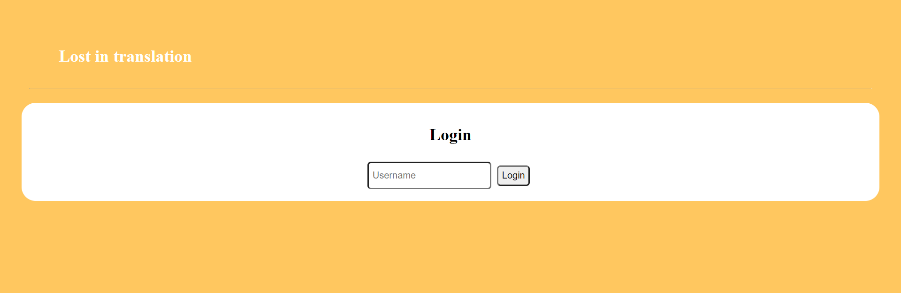
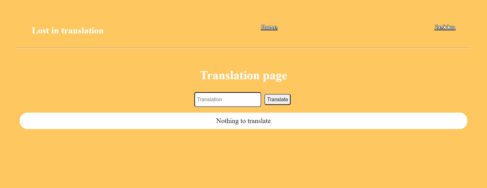
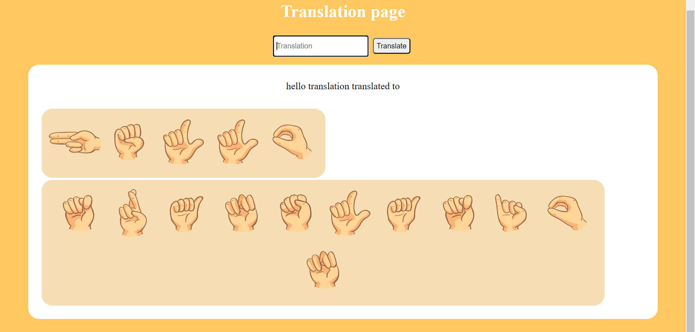
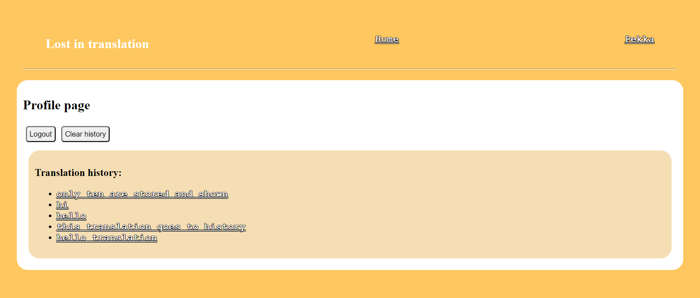
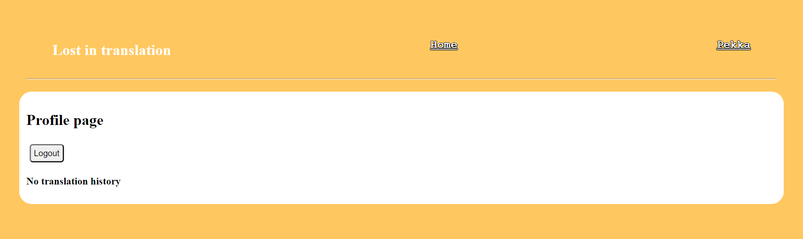
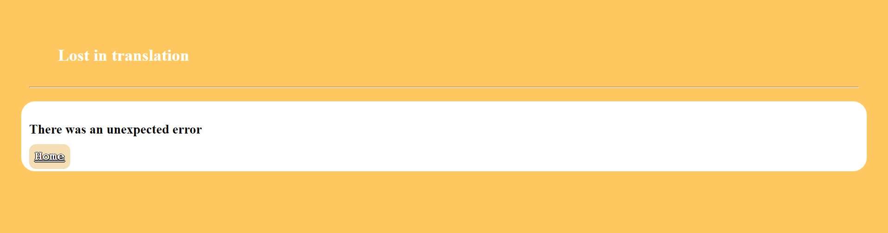

# Lost in translation

React front end project part of Experis academy front end course.

Application translates words and short sentences to American sign language.

## Table of contents
  - [About](#about)
    - [Application](#application)
    - [Translation page](#translation-page)
    - [User page](#user-page)
    - [Error page](#error-page)
  - [Usage](#usage)
  - [Getting Started with Create React App](#getting-started-with-create-react-app)

## About
Full task description can be found [here](./documents/JavaScript_LostInTranslation.pdf).

Application is created using create-react-app.

### Application

Application has two main pages. A tranlation page and user page. At first user is asked to log in. The username is stored in the local storage.

### Translation page
Translation page asks user for a translated sentence. 

The sentence is then translated into American sign language and shown to user.

Each translation is stored into local storage. The storage holds only last 10 translations. These are shown on user page. User can navigate to user page by clicking users username on the top right corner.

### User page

The user page shows users translation history. Each translation is a link back to translation page. Clicking the link will show the translated text in translation page.

User is also able to clear user history manually.

Clearing history will not show any previously translated sentences.

User is also able to logout from the user page. Logging out will clear the session storage and redirect user to login page.

### Error page
Error page is shown in case of navigation error.

## Usage

The project is build React version 11. Node.js package manager is used to download dependencies. To use the application you should
- Clone this repository [link to repositoy](https://github.com/veliValentine/lost-in-translation.git).
- Run commands
  - npm install
  - npm start
- open browser to localhost:3000

Or see [about](#About) for snippets.

By [veliValentine](https://github.com/veliValentine).
___

## Getting Started with Create React App

- [Lost in translation](#lost-in-translation)
  - [Table of contents](#table-of-contents)
  - [About](#about)
    - [Application](#application)
    - [Translation page](#translation-page)
    - [User page](#user-page)
    - [Error page](#error-page)
  - [Usage](#usage)
  - [Getting Started with Create React App](#getting-started-with-create-react-app)
    - [Available Scripts](#available-scripts)
      - [`npm start`](#npm-start)
    - [`npm run build`](#npm-run-build)
    - [`npm run eject`](#npm-run-eject)
    - [Learn More](#learn-more)
      - [Code Splitting](#code-splitting)
      - [Analyzing the Bundle Size](#analyzing-the-bundle-size)
      - [Making a Progressive Web App](#making-a-progressive-web-app)
      - [Advanced Configuration](#advanced-configuration)
      - [Deployment](#deployment)
      - [`npm run build` fails to minify](#npm-run-build-fails-to-minify)

This project was bootstrapped with [Create React App](https://github.com/facebook/create-react-app).

### Available Scripts

In the project directory, you can run:

#### `npm start`

Runs the app in the development mode.\
Open [http://localhost:3000](http://localhost:3000) to view it in the browser.

The page will reload if you make edits.\
You will also see any lint errors in the console.

### `npm run build`

Builds the app for production to the `build` folder.\
It correctly bundles React in production mode and optimizes the build for the best performance.

The build is minified and the filenames include the hashes.\
Your app is ready to be deployed!

See the section about [deployment](https://facebook.github.io/create-react-app/docs/deployment) for more information.

### `npm run eject`

**Note: this is a one-way operation. Once you `eject`, you can’t go back!**

If you aren’t satisfied with the build tool and configuration choices, you can `eject` at any time. This command will remove the single build dependency from your project.

Instead, it will copy all the configuration files and the transitive dependencies (webpack, Babel, ESLint, etc) right into your project so you have full control over them. All of the commands except `eject` will still work, but they will point to the copied scripts so you can tweak them. At this point you’re on your own.

You don’t have to ever use `eject`. The curated feature set is suitable for small and middle deployments, and you shouldn’t feel obligated to use this feature. However we understand that this tool wouldn’t be useful if you couldn’t customize it when you are ready for it.

### Learn More

You can learn more in the [Create React App documentation](https://facebook.github.io/create-react-app/docs/getting-started).

To learn React, check out the [React documentation](https://reactjs.org/).

#### Code Splitting

This section has moved here: [https://facebook.github.io/create-react-app/docs/code-splitting](https://facebook.github.io/create-react-app/docs/code-splitting)

#### Analyzing the Bundle Size

This section has moved here: [https://facebook.github.io/create-react-app/docs/analyzing-the-bundle-size](https://facebook.github.io/create-react-app/docs/analyzing-the-bundle-size)

#### Making a Progressive Web App

This section has moved here: [https://facebook.github.io/create-react-app/docs/making-a-progressive-web-app](https://facebook.github.io/create-react-app/docs/making-a-progressive-web-app)

#### Advanced Configuration

This section has moved here: [https://facebook.github.io/create-react-app/docs/advanced-configuration](https://facebook.github.io/create-react-app/docs/advanced-configuration)

#### Deployment

This section has moved here: [https://facebook.github.io/create-react-app/docs/deployment](https://facebook.github.io/create-react-app/docs/deployment)

#### `npm run build` fails to minify

This section has moved here: [https://facebook.github.io/create-react-app/docs/troubleshooting#npm-run-build-fails-to-minify](https://facebook.github.io/create-react-app/docs/troubleshooting#npm-run-build-fails-to-minify)
